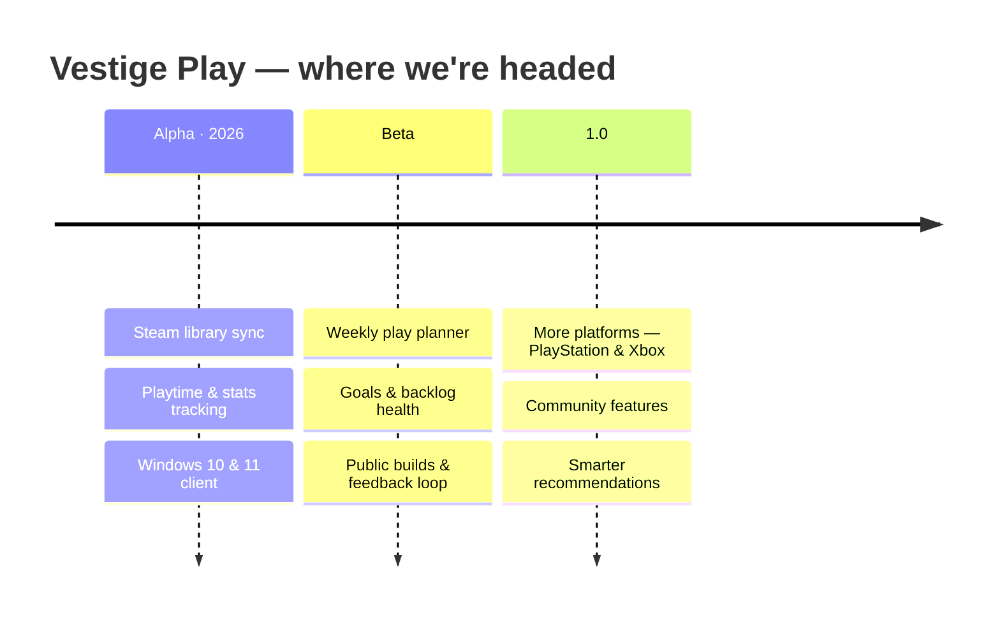

<picture>
  <source media="(prefers-color-scheme: dark)" srcset="https://vestigeplay.com/assets/Ghost-light.png" />
  
</picture>

  

### Play smarter, not tired.

A startup out of Buenos Aires 🇦🇷 · founded by Computer Science students

 

  

  
  &nbsp;
  
  &nbsp;
  
  &nbsp;
  

---

### ✦ &nbsp; WHO WE ARE &nbsp; ✦

A **vestige** is a trace left behind, something meaningful that endures after the moment has passed. We chose the name because it's the bar we hold our work to: not software that merely runs, but software people remember using.

We're a small, independent startup founded by Computer Science students who care about the whole craft: architecture, backend logic, interface, and the last mile of polish that most projects skip. We started by scratching our own itch, and we're building the tools we always wished existed.

---

### ✦ &nbsp; WHAT WE'RE BUILDING &nbsp; ✦

### 🎮 &nbsp;Vestige Play &nbsp;

**Your gaming journey, intelligently planned.**

We got tired of staring at 100 games on our steam library, with no idea what to play next. So we built the fix.

Vestige Play reads your library, tracks your playtime and stats, and turns "too many games, too little time" into a plan you'll actually follow, surfacing what to play next, and for how long, so your limited hours land on the right game.

- 📚 &nbsp;**Syncs your library** — connects to Steam and reads your collection automatically
- ⏱️ &nbsp;**Tracks time & stats** — playtime, completion, backlog health, streaks
- 🧭 &nbsp;**Plans your week** — a schedule built around the hours you actually have
- 🔒 &nbsp;**Respects your data** — Steam login stays with Steam; we never see your password

 

 

<b>&nbsp;See the full feature set</b>

 

| Area | What it does |
|:--|:--|
| 📚 &nbsp;**Library** | Auto-synced from Steam — every game, hours, and status in one place |
| 🧭 &nbsp;**Plan** | A weekly play plan sized to the time you actually have |
| 📅 &nbsp;**Calendar** | See your sessions and upcoming plan at a glance |
| 🎯 &nbsp;**Goals** | Set targets — finish a game, clear the backlog, hit a streak |
| 🗺️ &nbsp;**Journey** | Your history as a gamer, not just a list of pending games |
| 📊 &nbsp;**Stats** | Playtime, completion rate, backlog health, most-played genres |
| 🏆 &nbsp;**Milestones** | Progress and achievements as you go |

---

### ✦ &nbsp; HOW WE THINK &nbsp; ✦

<table>
  <tr>
    <td width="33%" align="center">
      <h4>🎯 &nbsp;Ship honestly</h4>
      No dark patterns, no vanity metrics, no hostage-taking your data. What you see is what it does.
    </td>
    <td width="33%" align="center">
      <h4>✨ &nbsp;Design is not decoration</h4>
      The interface <i>is</i> the product. We sweat the details most projects ship without.
    </td>
    <td width="33%" align="center">
      <h4>🚧 &nbsp;Build in the open</h4>
      Every release is documented. Our community sees the roadmap and shapes it.
    </td>
  </tr>
</table>

---

### ✦ &nbsp; HOW WE BUILD &nbsp; ✦

 

The stack behind our products: from the desktop client to the site above.

 

---

### ✦ &nbsp; ROADMAP &nbsp; ✦

Shipping in the open — every build is documented in the <a href="https://vestigeplay.com/changelog">changelog</a>.

---

### ✦ &nbsp; THE TEAM &nbsp; ✦

 

**Martín Sogoloff** &nbsp;·&nbsp; **Founder** - Full-Stack dev & Designer

  

Vestige Team is a small, growing startup. Want to build with us? &nbsp;<a href="https://discord.gg/WADstQz3Mu">Say hi on Discord →</a>

---

### ✦ &nbsp; COMMUNITY &nbsp; ✦

You're not just a download. Vestige is built in the open by a team that reads every message. Come hang out, report a bug, or help keep the lights on.

 

| | | |
|:--|:--|:--|
| 🐛 &nbsp;**Found a bug?** | Open an issue on any active repo or [click here](https://tally.so/r/XxkORg) | Every report gets read |
| 💡 &nbsp;**Got an idea?** | Start a Discussion, or drop it in Discord | We build in the open |
| ⭐ &nbsp;**Like what we do?** | Star the org | It motivates us more than you'd think |

---

### ✦ &nbsp; GET IN TOUCH &nbsp; ✦

 

 

<picture>
  <source media="(prefers-color-scheme: dark)" srcset="https://vestigeplay.com/assets/og-image.png" />
  
</picture>

  

Made with ❤️ &nbsp;·&nbsp; © 2026 Vestige Team

