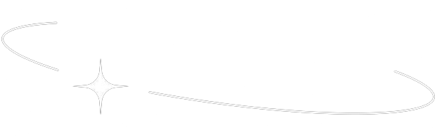
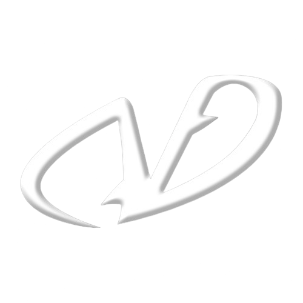

<div align="center">
  
<p align="center">
  
</p>

<br>

[](#)
[](#)
[](#)
[](#)

</div>

---

<div align="center">
  <h2>✦ ＷＨＯ　ＷＥ　ＡＲＥ ✦</h2>
  
</div>

**Vestige Team** is an independent software studio founded by Computer Science students driven by a simple belief: great software leaves a mark. Our name reflects our philosophy. A vestige is a trace left behind, something meaningful that endures. That's the kind of software we strive to create: products that leave a lasting impact through simplicity, usefulness, and quality.

---

<div align="center">
  <h2>✦ ＷＨＡＴ　ＡＲＥ　ＷＥ　ＢＵＩＬＤＩＮＧ？ ✦</h2>
    
</div>

### 💿 Vestige Play *(in development)*

> **Your gaming journey, intelligently planned.**

Vestige Play is a SaaS platform that helps gamers take control of their time by transforming their game library into an actionable weekly schedule. We connect to your existing library (Steam, PlayStation, Xbox, and more), analyze your backlog, and surface intelligent recommendations for what to play next, and for how long.

- 📚 **Learn more** on Vestige Play Docs

Whether you have 5 hours a week or 30, Vestige Play helps you spend them on the right game.

---

<div align="center">
  <h2>✦ ＲＥＰＯＳＩＴＯＲＹ　ＳＴＲＵＣＴＵＲＥ ✦</h2>
</div>

```text
vestige-team/
├── COMING NEXT
```

---

<div align="center">
  <h2>✦ ＣＯＮＴＲＩＢＵＴＩＮＧ ✦</h2>
</div>

We're not open for external contributions yet as we're heads-down on the core product, but we welcome:

- 🐛 **Bug reports** - Open an issue on any active repository
- 💡 **Feature ideas** - Start a GitHub Discussion in the relevant repo
- 🌟 **Stars** - They genuinely motivate us more than you'd think

When we open up contributions, full guidelines will live in `CONTRIBUTING.md` in each repository.

---

<div align="center">
  <h2>✦ ＧＥＴ　ＩＮ　ＴＯＵＣＨ ✦</h2>
</div>

<p align="center">
  <a href="mailto:vestige.corpteam@gmail.com">
    
  </a>
  <a href="https://www.linkedin.com/company/vestigeteam">
    
  </a>
  <a href="https://vestigeteam.dev">
    
  </a>
</p>

<br>

<div align="center">
  
</div>
<div align="center">
<h1>
  
  <p><sub>Made with love ❤️</sub></p>
</h1>
</div>
