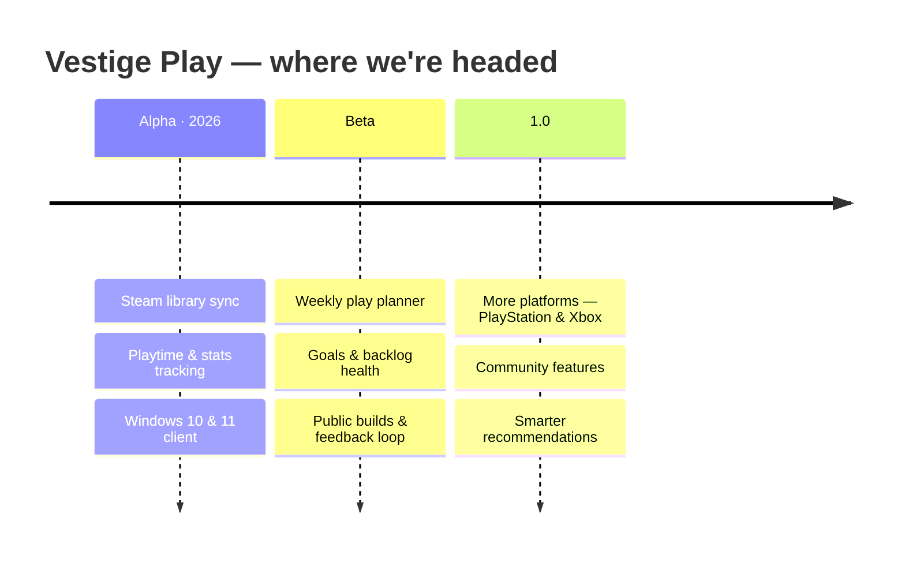

<picture>
  <source media="(prefers-color-scheme: dark)" srcset="https://vestigeplay.com/assets/Ghost-light.png" />
  
</picture>

  

### We build software that leaves a mark.

An independent studio out of Buenos Aires · founded by Computer Science students

 

---

### ✦ &nbsp; WHO WE ARE &nbsp; ✦

A **vestige** is a trace left behind — something meaningful that endures after the moment has passed. We picked the name because it's the bar we hold our work to: not software that merely runs, but software people remember using.

We're a small, independent studio founded by Computer Science students who care about the whole craft — architecture, backend logic, interface, and the last mile of polish that most projects skip. We ship deliberately, we ship honestly, and we sweat the details you'd notice.

> *Great software leaves a mark. We build both the code and the design — so it does.*

---

### ✦ &nbsp; WHAT WE'RE BUILDING &nbsp; ✦

### 🎮 &nbsp;Vestige Play &nbsp;· in active development

**Your gaming journey, intelligently planned.**

Vestige Play turns a sprawling game library into a plan you'll actually follow. It reads your backlog, tracks your playtime and stats, and surfaces what to play next — and for how long — so your limited hours land on the right game.

- 📚 &nbsp;**Syncs your library** — connects to Steam and reads your collection automatically
- ⏱️ &nbsp;**Tracks time & stats** — playtime, completion, backlog health, streaks
- 🧭 &nbsp;**Plans your week** — turns "180 games, no idea what to play" into a schedule
- 🖥️ &nbsp;**Runs on Windows** today — PlayStation, Xbox & more are on the roadmap
- 🆓 &nbsp;**Free, no account** — Steam login stays with Steam; we never see your password

 

 

---

### ✦ &nbsp; HOW WE BUILD &nbsp; ✦

 

The stack behind our products — from the desktop client to the site you're reading about above.

 

  

<table>
  <tr>
    <td align="center"><b>Frontend</b> TypeScript · React · Vite</td>
    <td align="center"><b>Backend</b> Python · FastAPI · Node.js</td>
    <td align="center"><b>Infra</b> Cloudflare · edge deploys</td>
    <td align="center"><b>Design</b> Figma · in-house system</td>
  </tr>
</table>

---

### ✦ &nbsp; ROADMAP &nbsp; ✦

Shipping in the open — every build is documented in the <a href="https://vestigeplay.com/changelog">changelog</a>.

---

### ✦ &nbsp; CONTRIBUTING &nbsp; ✦

We're heads-down on the core product, so external code contributions aren't open yet — but these genuinely help:

| | | |
|:--|:--|:--|
| 🐛 &nbsp;**Bug reports** | Open an issue on any active repo | Every report gets read |
| 💡 &nbsp;**Feature ideas** | Start a Discussion in the relevant repo | We build in the open |
| ⭐ &nbsp;**Stars** | Star what you like | They motivate us more than you'd think |

When we open up code contributions, guidelines will live in each repo's <code>CONTRIBUTING.md</code>.

---

### ✦ &nbsp; GET IN TOUCH &nbsp; ✦

 

 

<picture>
  <source media="(prefers-color-scheme: dark)" srcset="https://vestigeplay.com/assets/logo.png" />
  
</picture>

Made with ❤️ &nbsp;·&nbsp; © 2026 Vestige Team

